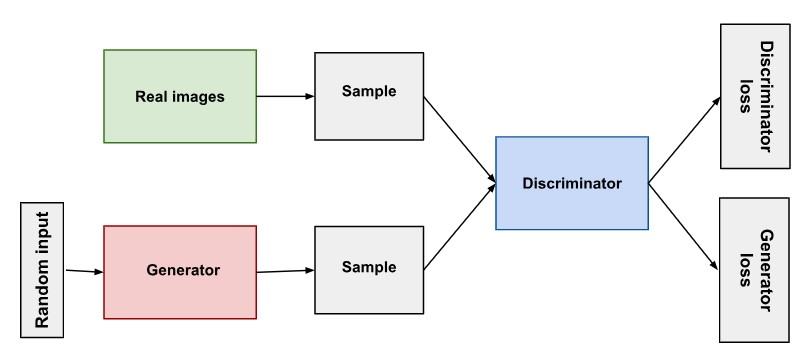

# Project
To build a Generative Adversarial Networks (GANs) made up of two neural networks, a - discriminator and a generator for an unsupervised learning of Fashion Mnist dataset. They use adversarial training to produce artificial data that is identical to actual data.
- The Generator attempts to fool the Discriminator, which is tasked with accurately distinguishing between produced and genuine fashion data, by producing random noise samples.
- Realistic, high-quality fashion samples are produced as a result of this competitive interaction, which drives both networks toward advancement.

# Project Architecture - Fashion Mnist Dataset
### 

# About Dataset
## Context
Fashion-MNIST is a dataset of Zalando's article images—consisting of a training set of 60,000 examples and a test set of 10,000 examples. Each example is a 28x28 grayscale image, associated with a label from 10 classes. Zalando intends Fashion-MNIST to serve as a direct drop-in replacement for the original MNIST dataset for benchmarking machine learning algorithms. It shares the same image size and structure of training and testing splits.

## Content
Each image is 28 pixels in height and 28 pixels in width, for a total of 784 pixels in total. Each pixel has a single pixel-value associated with it, indicating the lightness or darkness of that pixel, with higher numbers meaning darker. This pixel-value is an integer between 0 and 255. The training and test data sets have 785 columns. The first column consists of the class labels (see above), and represents the article of clothing. The rest of the columns contain the pixel-values of the associated image.

### Labels

Each training and test example is assigned to one of the following labels:

- 0 T-shirt/top
- 1 Trouser
- 2 Pullover
- 3 Dress
- 4 Coat
- 5 Sandal
- 6 Shirt
- 7 Sneaker
- 8 Bag
- 9 Ankle boot

### Dataset Sample
### 

## Preprocessing the Data
Preprocessing the dataset by Scaling the images and implementing various transformations, including caching, shuffling, batching, and prefetching. It ensures dataset is ready for training.
### 

## Building the Generator
The generator, designed to transform random noise into realistic fashion images through series of upsampling and convolutional layers.
### 

## Building the Discriminator
The discriminator, designed to distinguish the generated fake fashion images through a series of convolutional layers and flattening the dense layer.
### 

## Training the Model
The creation of a custom subclassed model, FashionGAN, combines both the generator and discriminator. The training loop involved alternating steps, training the discriminator and generator to achieve a adversarial learning.

## Reviewing Performance
visualizing the progress became essential, the below image is a display of discriminator and generator losses over the 100 epochs.
### 

